# Deep Reinforcement Learning — Assignment #3

**Ben-Gurion University of the Negev**
Faculty of Engineering Sciences | Department of Software and Information Systems

**Authors:** Oz Elbaz (204388763) & Ido Gurevich (205478068)

---

## Overview

This project implements and compares three approaches for training A2C (Advantage Actor-Critic) agents across multiple OpenAI Gymnasium environments:

1. **Training individual networks** from scratch on CartPole-v1, Acrobot-v1, and MountainCarContinuous-v0.
2. **Fine-tuning** a pre-trained model by retraining its final layers on a different environment.
3. **Transfer learning** via Progressive Neural Networks, leveraging knowledge from two pre-trained agents to accelerate learning on a new task.

To enable transfer learning across environments, all agents share a **standardized input dimension of 6** (matching the largest state space) and an **actor output dimension of 3** (matching the maximum number of actions). Hyperparameter tuning was performed using **Optuna**.

---

## Project Structure

```
RL_ass3/
├── Part1_IndividualNet/
│   ├── CartPole_AC/
│   │   ├── CartPole_AC.py
│   │   ├── cartpole_policy.pth
│   │   ├── cartpole_value.pth
│   │   ├── HyperparameterImportance.png
│   │   └── optimization_HistoryPlot.png
│   ├── Acrobot_AC/
│   │   ├── Acrobot_AC.py
│   │   ├── acrobot_policy.pth
│   │   ├── acrobot_value.pth
│   │   ├── HyperparameterImportance1.png
│   │   └── OptimizationHistory_Acrobot1.png
│   └── MountainCar_AC/
│       ├── MountainCar_AC.py
│       ├── mountain_policy.pth
│       └── mountain_value.pth
├── Part2_FineTuneModel/
│   ├── acrobot2cartpole.py
│   └── cartpole2mountaincar.py
├── Part3_TransferLearning/
│   ├── prog_carpole.py
│   └── prog_mountcar.py
├── Assignment3_Report.pdf
├── requirements.txt
└── README.md
```

---

## Installation & Setup

```bash
# Create and activate virtual environment
python -m venv venv

# Windows
venv\Scripts\activate

# Linux / macOS
source venv/bin/activate

# Install dependencies
pip install -r requirements.txt
```

---

## Section 1 — Training Individual Networks

Three A2C agents were trained independently, each on a different Gymnasium environment.

### 1.1 CartPole-v1

The agent receives a reward of **+1** for every time step the pole remains balanced. Episodes have a maximum of **500 steps**, and early stopping triggers when the average reward over the last 100 episodes exceeds **475**.

**Architecture:**

| Component | Layers | Hidden Size | Activation |
|-----------|--------|-------------|------------|
| Actor     | 3 × Linear | 12 | ReLU (hidden), None (output) |
| Critic    | 3 × Linear | 64 | ReLU (hidden), Softmax (output) |

**Hyperparameter Tuning:**

Optuna was used to search over learning rates and discount factors. The value network learning rate turned out to be the most impactful hyperparameter (importance: **0.82**), suggesting the policy network architecture could be improved.

<p align="center">
  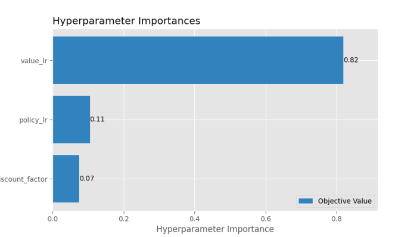
  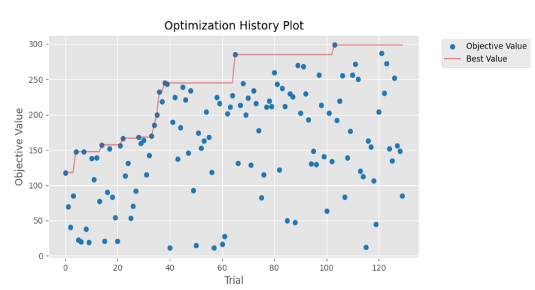
</p>

**Best Hyperparameters:**

| Parameter | Value |
|-----------|-------|
| Discount factor | 0.99 |
| Actor LR | 0.0001 |
| Critic LR | 0.005 |

The agent converged after approximately **700 episodes** (~161 seconds), reaching a stable reward of 500 per episode.

<p align="center">
  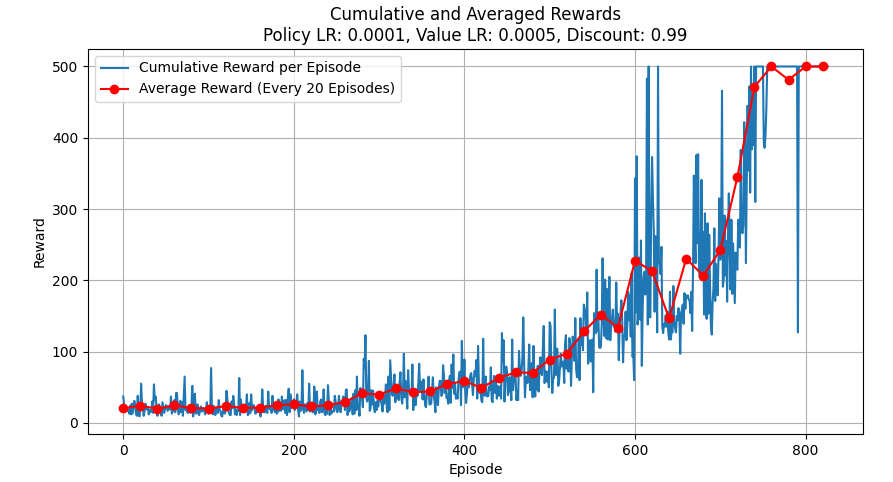
</p>

---

### 1.2 Acrobot-v1

The agent receives a reward of **-1** per time step while the pole remains below the target height. Episodes are capped at **500 steps**, with early stopping when the average reward exceeds **-100** over the last 100 episodes.

**Architecture:**

| Component | Layers | Hidden Size | Activation |
|-----------|--------|-------------|------------|
| Actor     | 3 × Linear | 12 | ReLU (hidden), None (output) |
| Critic    | 3 × Linear | 64 | ReLU (hidden), None (output) |

**Hyperparameter Tuning:**

Similar to CartPole, the value network learning rate dominated hyperparameter importance at **0.86**.

<p align="center">
  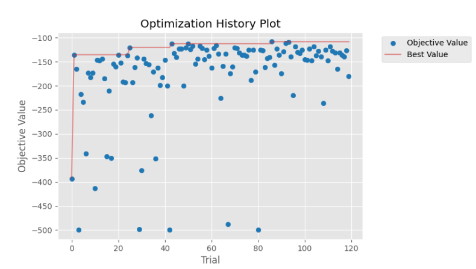
  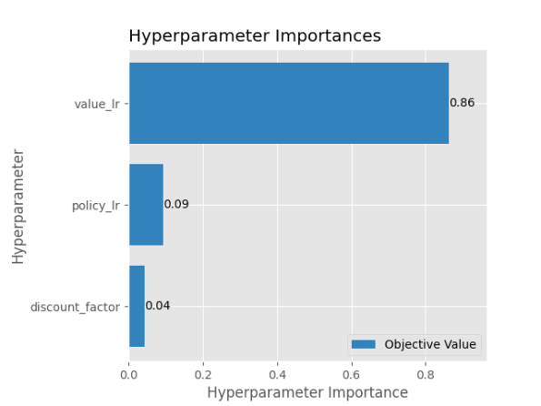
</p>

**Best Hyperparameters:**

| Parameter | Value |
|-----------|-------|
| Discount factor | 0.99 |
| Actor LR | 0.001 |
| Critic LR | 0.001 |

The agent converged remarkably fast — after only **~20 episodes** (~24 seconds).

<p align="center">
  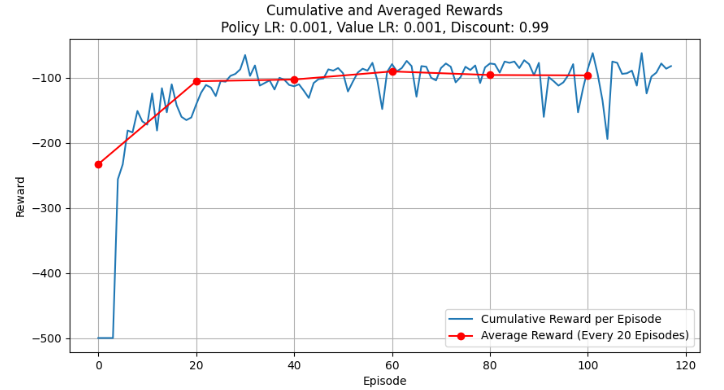
</p>

---

### 1.3 MountainCarContinuous-v0

This environment presents a unique challenge: if the agent fails to reach the right hill early in training, it learns to stay stationary and settles at a local maximum reward of **0**, missing the much higher reward available for reaching the goal. To combat this, the agent's weights are **reset if it fails to reach the right hill within 3 consecutive episodes**, encouraging exploration.

Episodes are capped at **999 steps**, with early stopping when the average reward exceeds **50** over 100 episodes.

**Architecture:**

| Component | Layers | Hidden Size | Activation |
|-----------|--------|-------------|------------|
| Actor     | 3 × Linear | 16 | ReLU (hidden), None (output) |
| Critic    | 3 × Linear | 64 | ReLU (hidden), None (output) |

**Best Hyperparameters:**

| Parameter | Value |
|-----------|-------|
| Discount factor | 0.99 |
| Actor LR | 0.00001 |
| Critic LR | 0.000055 |

The agent converged after approximately **60 episodes** (~172 seconds).

<p align="center">
  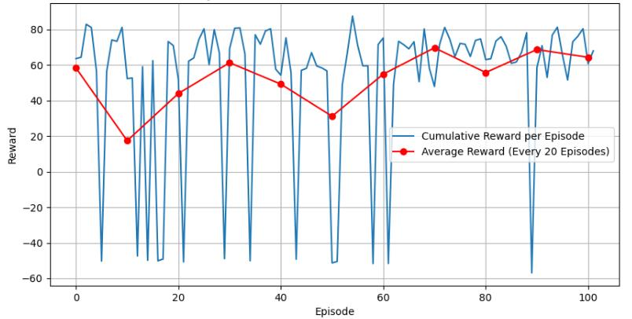
</p>

---

## Section 2 — Fine-Tuning an Existing Model

In this section, two pre-trained models had their **final layers retrained** on a new, different environment while keeping the earlier layers frozen.

### 2.1 Acrobot-v1 → CartPole-v1

Five hyperparameter configurations were tested. Despite exploring a range of learning rates and discount factors, **none of the configurations achieved full convergence** within 1,000 episodes.

| Config | Discount | Actor LR | Critic LR | Runtime (s) | Converged |
|--------|----------|----------|-----------|-------------|-----------|
| A (Original Acrobot) | 0.99 | 0.001 | 0.001 | 287 | No |
| B (Original CartPole) | 0.99 | 0.0001 | 0.0005 | 51 | No |
| C | 0.999 | 0.001 | 0.001 | 146 | No |
| D | 0.99 | 0.0005 | 0.001 | 256 | No |
| **\*** | **0.99** | **0.0008** | **0.001** | **312** | **No** |

The best-performing agent (marked \*) managed to hit a reward of 500 after ~500 episodes but couldn't sustain it consistently.

<p align="center">
  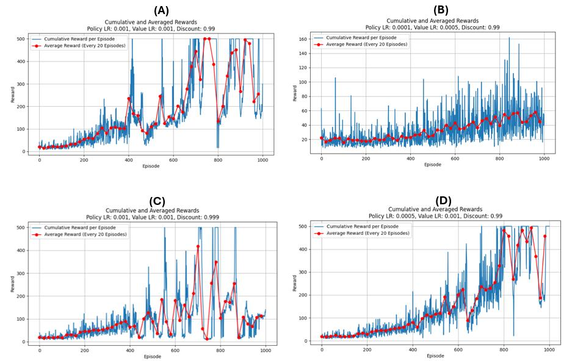
</p>

<p align="center">
  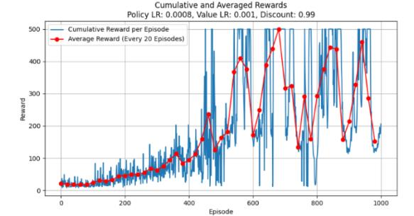
</p>

The transfer failure is attributed to the **fundamental differences between the two tasks**: Acrobot involves controlling a double pendulum with complex, nonlinear dynamics and swing-up behavior, while CartPole requires linear, reactive balance control. The skills learned in one do not directly translate to the other. Differences in state space representation, control frequency, and reward structure also contributed to the difficulty.

---

### 2.2 CartPole-v1 → MountainCarContinuous-v0

Four configurations were tested, each run **10 times** for reliability.

| Config | Discount | Actor LR | Critic LR | Runtime (s) | Convergence (ep.) |
|--------|----------|----------|-----------|-------------|-------------------|
| **A (Original CartPole)** | **0.99** | **0.0001** | **0.0005** | **138** | **101** |
| B (Original MountainCar) | 0.99 | 0.00001 | 0.000055 | 273 | No |
| C | 0.999 | 0.00001 | 0.000055 | 178 | 105 |
| D | 0.99 | 0.00005 | 0.00055 | 169 | 103 |

The original CartPole hyperparameters (Config A) produced the best results — shortest runtime and earliest convergence at **101 episodes**. All agents except B achieved an average reward above 50 over 100 episodes, though oscillations were present throughout training, likely due to the differing dynamics between environments. A deeper network may be needed to better capture the MountainCar environment's characteristics.

<p align="center">
  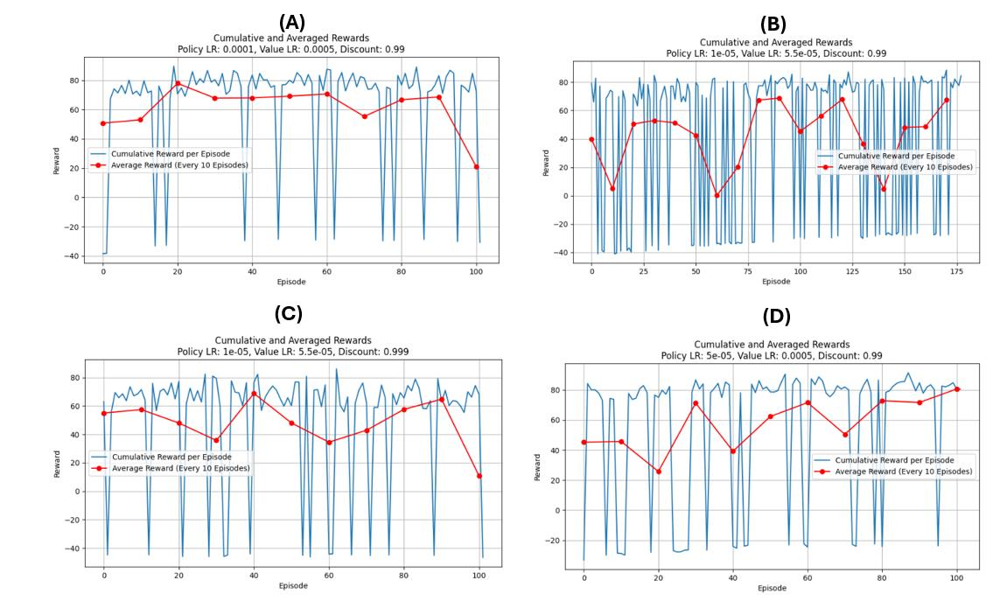
</p>

---

## Section 3 — Transfer Learning with Progressive Networks

Progressive Neural Networks were used to leverage knowledge from **two pre-trained agents** (with frozen weights) to accelerate learning on a new target task. The progressive architecture was applied **only to the actor (policy network)**, while the critic was trained independently for each target environment. This design choice allows the critic to adapt freely to the target environment's reward structure without interference, while the actor benefits from transferable motor skills like balancing and navigating.

<p align="center">
  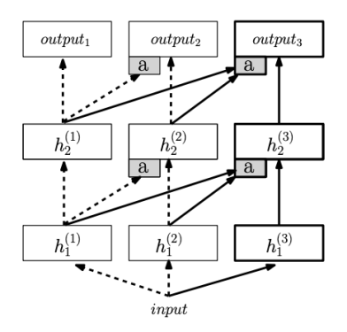
</p>

The architecture consists of three columns: h^(1) (Acrobot), h^(2) (MountainCar or CartPole), and h^(3) (the new target task). Lateral connections with adapter modules (marked "a") feed activations from earlier columns into the new column at each layer.

---

### 3.1 Acrobot + MountainCar → CartPole-v1

Five hyperparameter configurations were tested, each running up to 1,000 episodes (max 500 steps/episode).

| Config | Discount | Actor LR | Critic LR | Runtime (s) | Convergence (ep.) |
|--------|----------|----------|-----------|-------------|-------------------|
| A (Original CartPole) | 0.99 | 0.0001 | 0.0005 | 734 | No |
| B (Original MountainCar) | 0.99 | 0.0005 | 0.0005 | 652 | No |
| C | 0.99 | 0.00005 | 0.0005 | 407 | 840 |
| **\*** | **0.999** | **0.00005** | **0.0005** | **350** | **717** |
| D | 0.999 | 0.0008 | 0.0005 | 450 | No |

<p align="center">
  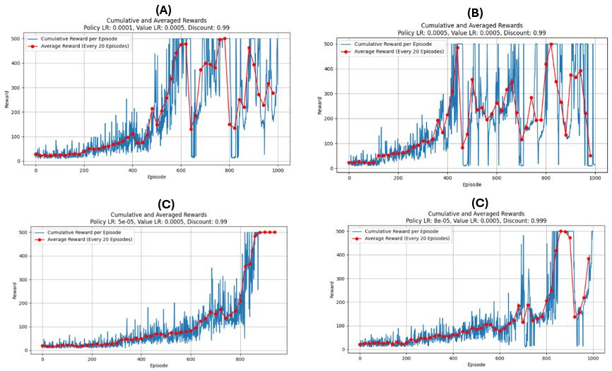
</p>

The best agent (marked \*) converged at **~717 episodes** and first achieved a reward of 500 around episode 660. Compared to the baseline model from Section 1 (which stabilized around ~800 episodes), the progressive network reached stability **~140 episodes faster**, demonstrating that the transferred features from Acrobot and MountainCar provided a meaningful learning advantage.

**Best Hyperparameters:**

| Parameter | Value |
|-----------|-------|
| Discount factor | 0.999 |
| Actor LR | 0.00005 |
| Critic LR | 0.0005 |

<p align="center">
  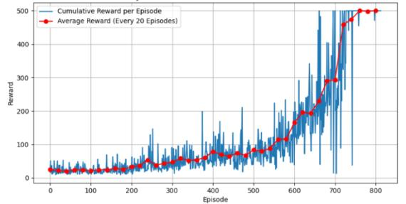
</p>

---

### 3.2 Acrobot + CartPole → MountainCarContinuous-v0

Five configurations were tested, up to 1,000 episodes (max 500 steps/episode).

| Config | Discount | Actor LR | Critic LR | Runtime (s) | Convergence (ep.) |
|--------|----------|----------|-----------|-------------|-------------------|
| A (Original MountainCar) | 0.99 | 0.00001 | 0.00055 | 278 | 62 |
| **\*** | **0.99** | **0.0001** | **0.00055** | **267** | **43** |
| B | 0.99 | 0.001 | 0.0005 | 275 | No |
| C | 0.999 | 0.0001 | 0.00055 | 247 | No |
| D | 0.999 | 0.001 | 0.0005 | 202 | No |

<p align="center">
  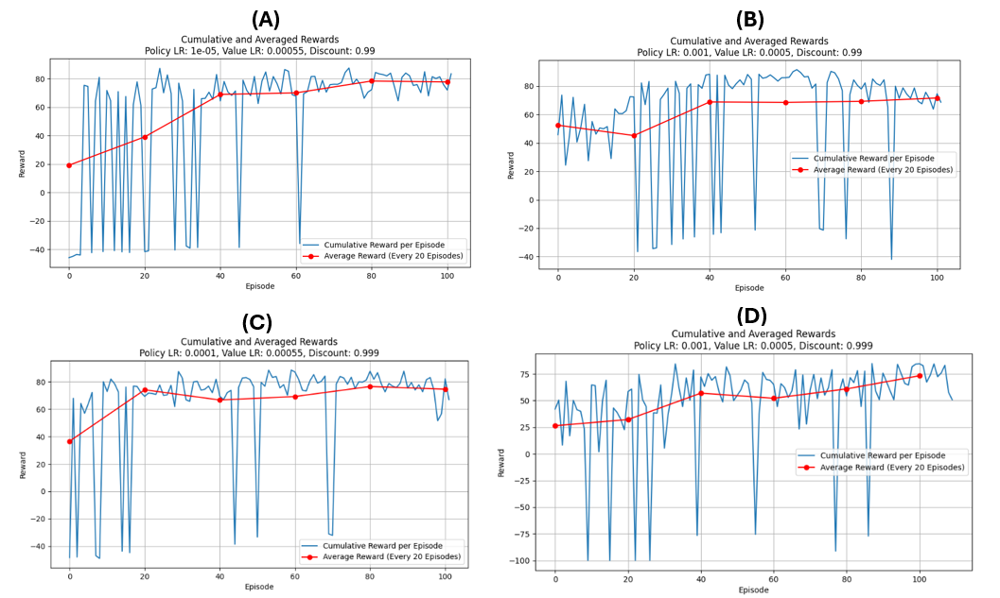
</p>

Only configurations A and \* managed to stabilize — the rest showed persistent oscillations. The best agent (marked \*) converged in just **~43 episodes** with no oscillations and the shortest runtime, significantly outperforming the from-scratch agent from Section 1 which took ~60 episodes. The transferred knowledge from Acrobot and CartPole clearly accelerated the learning process.

**Best Hyperparameters:**

| Parameter | Value |
|-----------|-------|
| Discount factor | 0.99 |
| Actor LR | 0.0001 |
| Critic LR | 0.00055 |

<p align="center">
  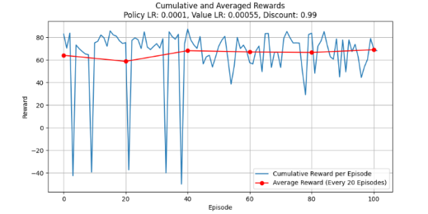
</p>

---

## Key Findings

- **Value network learning rate** is consistently the most impactful hyperparameter across all environments (importance > 0.80).
- **Fine-tuning across dissimilar environments** (Acrobot → CartPole) can fail entirely when the source and target dynamics are fundamentally different (swing-up vs. balance control).
- **Fine-tuning across compatible environments** (CartPole → MountainCar) can succeed, especially when the source environment's hyperparameters transfer well.
- **Progressive networks** provide a consistent advantage over both training from scratch and simple fine-tuning. They achieved faster convergence on CartPole (~660 vs. ~800 episodes) and MountainCar (~43 vs. ~60 episodes).
- Applying the progressive architecture **only to the actor** (not the critic) was a deliberate design choice — it allows the critic to adapt independently to the target environment's reward structure, avoiding instability.
- The **weight reset mechanism** in MountainCarContinuous (resetting after 3 failed episodes) was essential to prevent the agent from settling at the local maximum of 0.

---

## Running the Scripts

```bash
# Activate virtual environment
# Windows
venv\Scripts\activate
# Linux / macOS
source venv/bin/activate

# Section 1 — Train individual agents
python Part1_IndividualNet/CartPole_AC/CartPole_AC.py
python Part1_IndividualNet/Acrobot_AC/Acrobot_AC.py
python Part1_IndividualNet/MountainCar_AC/MountainCar_AC.py

# Section 2 — Fine-tune models
python Part2_FineTuneModel/acrobot2cartpole.py
python Part2_FineTuneModel/cartpole2mountaincar.py

# Section 3 — Progressive networks
python Part3_TransferLearning/prog_carpole.py
python Part3_TransferLearning/prog_mountcar.py
```
